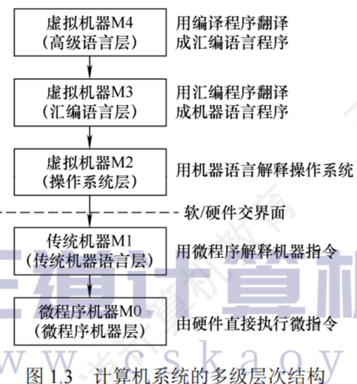
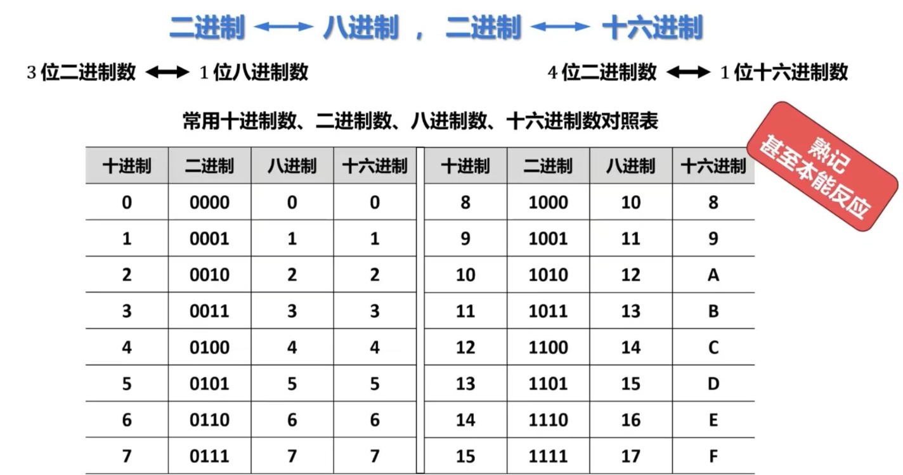
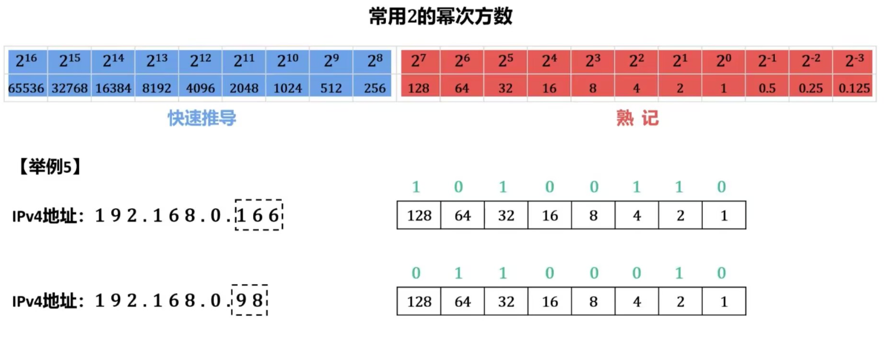
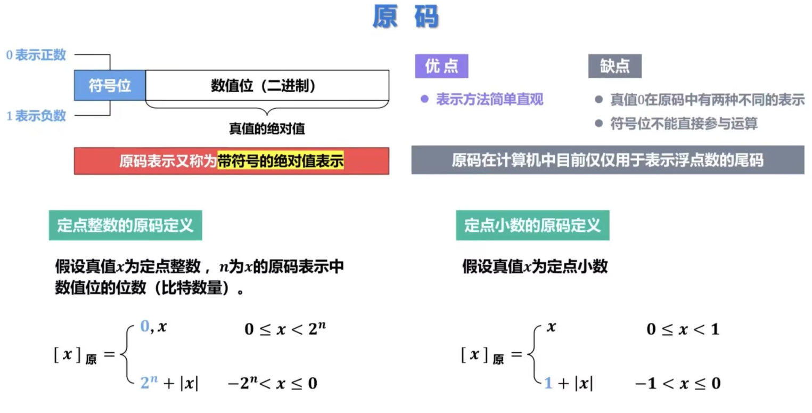
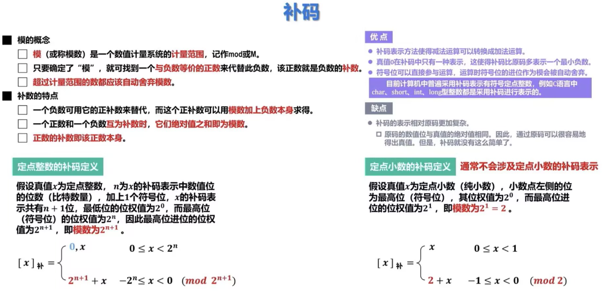
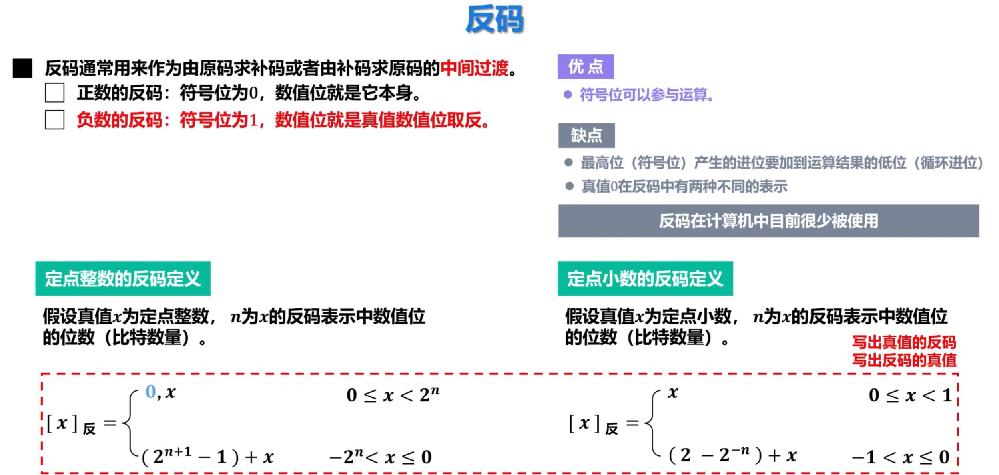
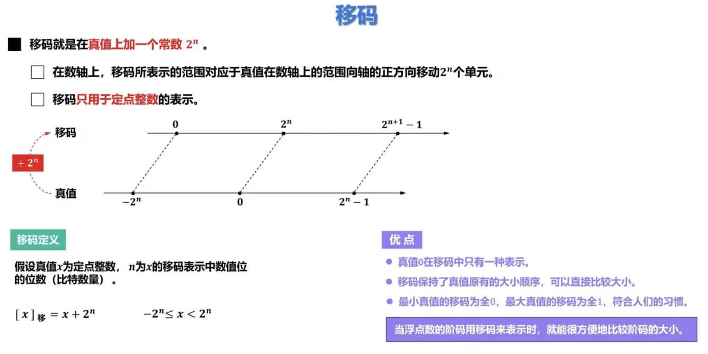
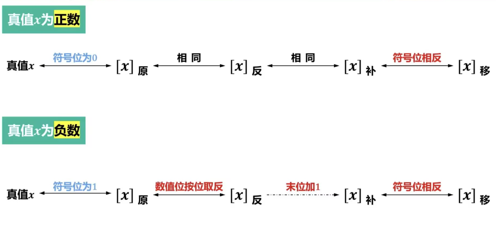
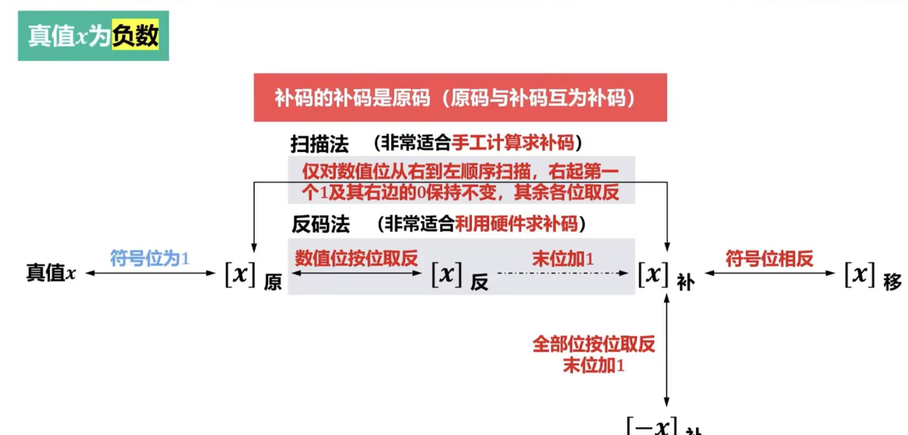

#flashcards

# 1. 计算机系统概述
## 个人总结和思考
该部分为总体的概述，目的是建立对计算机系统整体结构与某些核心概念的初步认知。
其中最重要的是一些基本原理以及计算机的性能指标。
## 1.1计算机发展历程
这部分被大纲删除，主要讲的是计算机硬件，软件的发展 以及计算机元件的更新迭代。
## 1.2 计算机系统层次结构
计算机系统的组成，计算机硬件，计算机软件；计算机系统的层次结构，计算机系统的工作原理
### 1.2.1 计算机系统的组成
一个完整的计算机系统由软件和硬件组成。计算机系统设计必须合理规划软硬件的功能边界。
### 1.2.2计算机硬件
 **冯诺依曼机的思想：“存储程序”**
- 主要特点：
	1. 存储程序的工作方式，预先编好的程序和数据存入主存，后续计算机可以自动工作
	2. 硬件系统的五大部件：运算器，控制器，存储器，输入设备和输出设备
	3. 指令和数据在存储器中以相同的形式存放，但计算机可以识别区分
	4. 指令和数据都由二进制编码表示
	5. 指令＝操作码+地址码
	6. 以运算器为核心，又计算又中转数据、效率低下
**计算机的功能部件**
- 中央处理器（CPU）：负责指令执行，传统:运算器+控制器；现代：数据通路+控制单元
	数据通路：执行实际运算的硬件通路，核心：算数逻辑单元（ALU），通用寄存器组
	算术逻辑单元（ALU）：负责算数和逻辑运算
	通用寄存器组：为ALU提供操作数和暂存运算结果
- 存储器：内存+外存
	1存储体------n个存储单元（与地址一一对应，n=2^MAR位数）------n×m个存储元件（存一个1/0， m为存储字长=MDR位数）
	现代内存：主存+高速缓存（Cache），传统内存仅指主存
	外存：与主存进行数据交换的磁盘或固态硬盘；长期备份数据的磁带，光盘
- 外部设备和设备控制器（也就是输入设备和输出设备）
	外部设备简称外设，也叫I/O设备，外设通过设备控制器连接到主机上
	各种设备控制器统称I/O控制器或I/O接口 
- 运算器（算术运算和逻辑运算）
	核心单元ALU+通用寄存器保存操作数和中间临时结果+累加器ACC，乘商寄存器MQ，操作数寄存器X，变址寄存器IX（Index Register），基址寄存器BR，标志寄存器PSW
- 控制器（计算器的指挥中心）
	计数寄存器PC、指令寄存器IR（存放当前取出来的指令，并且将指令拆分成各个部分送给其它部件来执行运算，内容来自于MDR）、控制单元CU
**内容的透明性：IR、MAR、MDR对于各类程序员来说都是透明的**
### 1.2.3计算机软件
- 软件分类
	系统软件还包括：语言处理程序、分布式软件系统、网络软件系统、标准库程序、服务性程序系统程序员：编写操作系统和编译程序应用程序员：

- 三个级别的语言
	机器语言：计算机唯一可以识别的语言
	汇编语言：必须经过汇编程序翻译成机器语言才能在硬件上执行
	高级语言：可以由高级语言直接翻译成机器语言，也可以由高级语言先翻译汇编语言

- 三种翻译程序
	汇编程序：由汇编语言翻译成机器语言
	解释程序：将源程序按照执行顺序逐条翻译成机器指令并立即执行
	编译程序：将高级语言程序翻译成汇编语言或者机器语言(边翻译边执行)
**计算机的软硬件逻辑功能等价**
### 1.2.4计算机系统的层次结构
软件和硬件的界面就是ISA指令集体系结构，ISA定义了这台计算机可以执行的所有指令的集合，也称作软件可见部分

### 1.2.5计算机系统的工作原理
“存储程序”工作方式
高级语言程序与机器语言程序之间的转换
程序和指令的执行过程
- 1.从源程序到可执行文件，翻译的四个阶段
	①预处理，将库文件插入到程序文件内容当中，输出hello.i
	②编译，由编译器对预处理后的源文件进行编译，输出hello.s汇编语言程序
	③汇编，汇编器将 hello.s翻译成机器语言，并且输出可重定位目标代码文件hello.o
	④链接程序，连接器ld将多个.o二进制文件和标准库函数pritf所在的目标模块printf.o文件合并，生成可执行文件hello.exe，最终保存到磁盘里
- 2.指令执行过程
	特别注意的是第一次从MAR的地址到M中寻得的是指令，先存到MDR里面，再存到IR里面，然后分析成两部分，操作码交给CU，操作数的地址交给MAR
	（PC）带括号表示PC里面的内容，所以执行PC自增，应该为(PC)+1→ PC

## 1.3计算机性能指标
吞吐量、响应时间；CPU时钟周期、主频、CPI、CPU执行时间；
MIPS、MFLOPS、GFLOPS、TFLOPS、PFLOPS、EFLOPS、ZFLOPS。
- **机器字长**
	1. 16位32位通常指计算机一次可以处理数据的最大位数，等于通用寄存器的位数，ALU的宽度。
	2. 指令字长一般不确定，可以为存储字长的二倍、一倍甚至三倍四倍，多倍数就需要多次取指令
	3. 存储字长指的是一个存储单元里包含的存储元件的位数，一般来说以字节为单位，那存储字长就是8bit

- **总线带宽计算**
	数据通路带宽是指数据总线一次能购物并行传送信息的位数。
	$总线带宽=总线位数\times总线的工作频率$
	$总线工作频率=时钟频率\div总线周期数$
	（这里的总线周期数也叫总线的传输周期，是指总线完成一个工作需要几个时钟周期（或者也叫总线周期），一般情况下是4个时钟周期）

- **主存容量计算**
	1. $主存容量=编址的存储单元个数*每个编址的单元的字节数$（可通过MAR 和MDR位数推出）
	2. 为什么是每个编址？因为存储器会按照字节编址和字编址。
	3. 如果按照字节编址，那么每个存储单元都有一个地址，每个存储单元字节数为1B
	4. 如果按照字编址，那么每个字会有一个地址，每个地址的存储字节数为2B、4B

- **吞吐量**
	单位时间内处理请求的数量，需要各个部件联合共同努力才能提升，只给输入系统提速或只给CPU提速并不管用。它并没有固定的单位，通常是200w/天、200/s这样的形式。

- **响应时间**
	通常包括 **CPU时间 + 等待时间**（这个等待时间很复杂，包括磁盘访问、存储器访问、I/O操作、操作系统开销、甚至网络时延）

- **CPU时钟周期**（CPU处理器的基本、最小时间单位）
	时钟周期的的确确就是一个时间，非常非常短的时间，它等于主频的倒数，本质上也等于一个时钟脉冲信号在时间上的宽度。

- **主频**（也叫CPU时钟频率）
	表示1秒内有几个时钟周期，单位是Hz。10Hz表示1秒内有10个时钟周期，每个CPU时钟周期为0.1s。主频越大则性能相对更好一些。

- **CPI**（Cycle Per Instruction）
	执行一条指令需要的时钟周期数。另外 **IPC** 等于CPI的倒数，表示每个时钟周期能运行多少条指令。

- **IPS**（Instruction Per Second）
	每秒执行的指令数量。

- **CPU执行时间**
	$CPU执行时间 = 时钟周期数 \div 主频$
	因为主频本质就是1秒内所含有的时钟周期数量。
	运行一个程序所需要花费的时间，通常给出一个程序有多少条指令、每条指令需要几个时钟周期、时钟周期是多少s。
- **MIPS** (Million Instructions per second)
	① $指令条数 \div (t \times 10^6) = MIPS$
	② $主频 \div (CPI \times 10^6) = MIPS$，这里的 $10^6$ 代表一百万
- **FLOPS** （Floating-point Operation Per Second）
	每秒执行多少次浮点运算

**常用单位前缀表**

| 前缀  |    数量级    |  中文  |
| :-: | :-------: | :--: |
|  K  |  $10^3$   |  千次  |
|  M  |  $10^6$   | 百万次  |
|  G  |  $10^9$   | 十亿次  |
|  T  | $10^{12}$ | 万亿次  |
|  P  | $10^{15}$ | 千万亿次 |
|  E  | $10^{18}$ | 百京次  |
|  Z  | $10^{21}$ | 十万京次 |
$$
1京 = 1亿亿次 = 10^{16}
$$

# 2.数据表示和运算
## 个人思考与总结
## 2.1数制和编码
1. 二进制B，十进制D，十六机制H、0x
      二进制，八进制，十六进制互转
2. 十进制数转换为任意进制数：整数部分---除基取余法，小数部分---乘基取整法
	十进制到二进制凑值法，记住常用的二的幂次方数
	
3. 不是每个十进制小数都可以准确的用二进制表示，反之可以，整数也可以
4.  真值 vs 机器数（0正1负）
5. 定点数（小数点位置固定，常规计数） vs 浮点数（科学计数法）
6. 定点数：
	   ①无符号数：无符号位，全是数值位。n位无符号数表示范围：0 ~ 2n-1。 无符号数只有整数没有小数，unsigned int/long（float ×） 
	   ②有符号数：符号位+尾数。整数、小数部分分别保存，小数点分别在最后和符号位
	1. 原码
	
	2.  补码
	
	**补码的特点：同为正数或负数的情况下：仅看数值位，数值位的值越大，真值越大**
	理解：**补码里，把符号位也当成数值位的一部分，整个数就是一个"二进制里程表"。**
	里程表从000...0(0）一直往上滚，滚过最大值011...1（最大正数），再滚一步变成100...0（最小负数），继续滚到111...1(-1)，再一步回到000...0。
	所以补码编码是完全单调的——二进制编码越大，真值越大，和正数负数没关系。
	
	3.  反码
	
	4.  移码
	
	**移码的偏置位的理解:** n+1字长的补码，只能用n位，表示范围 $-2^n \sim 2^n-1$，偏置值其实就是把符号位当做数值位为 $2^n$，移码值就是真值加上$2^n$，这个时候移
	5. 转化
	
	**双向箭头表示操作双向有用，单向表示单方向有用**
	