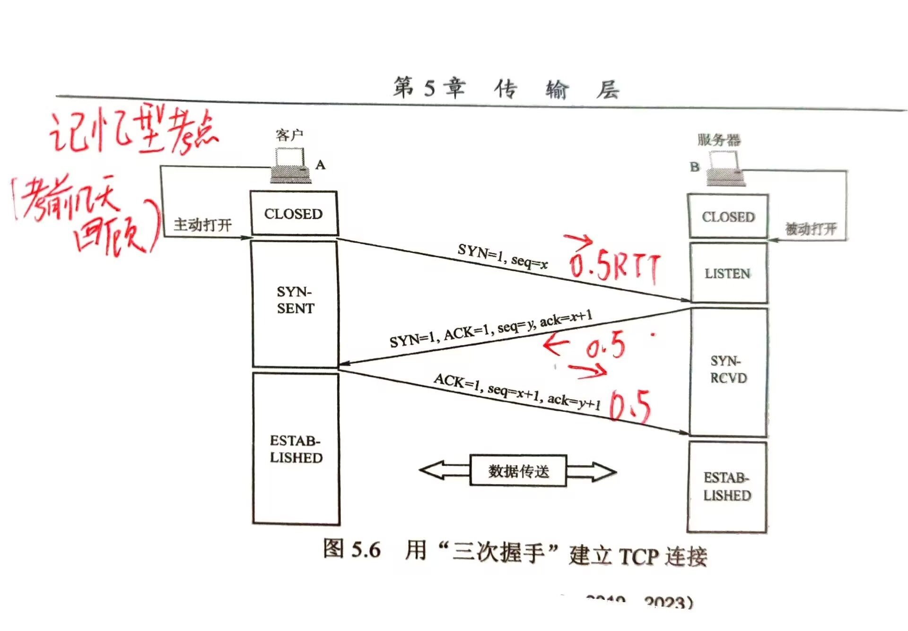

**这些内容需要考前去记忆**
# 数据结构

# 计算机组成原理

# 操作系统

# 计算机网络
## 4.1 计算机网络体系结构
## 4.2 物理层
## 4.3 数据链路层
## 4.4 网络层
## 4.5 传输层
#TCP连接的建立和释放过程中：客户端和服务器的状态

	
#DNS分层域名系统
	DNS是因特网上解决域名到IP地址转换的系统。
	1. 域名结构：采用层次结构的命名方法，每个域名都由标号序列组成，各标号之间用点隔开。
		* 根域名（.）
		* 顶级域名(TLD)：国家顶级域名(cn, us, uk)，通用顶级域名(com, org, net, gov)，基础结构域名(arpa)
		* 二级域名：例如，baidu.com 中的 baidu
		* 三级域名：例如，www.baidu.com 中的 www
	2. 域名服务器：
		* 根域名服务器：最高层，负责管理顶级域名服务器。
		* 顶级域名服务器：管理在该顶级域名下注册的所有二级域名。
		* 授权域名服务器：负责一个“区”的域名服务器。
		* 本地域名服务器：当一台主机发出DNS查询请求时，这个请求首先发给本地域名服务器。

## 4.6 应用层
