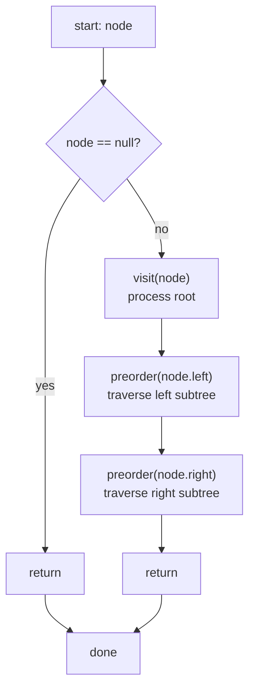

## 二叉树前序遍历（递归法）

### 时间复杂度

- **时间复杂度：O(n)** — 每个节点被访问恰好一次，n 为二叉树的节点总数
- **空间复杂度：O(h)** — h 为树的高度，递归调用栈的深度；最坏情况（链表式二叉树）h = n，为 O(n)；平衡二叉树为 O(log n)

### 执行逻辑（根 → 左 → 右）

1. 访问当前节点（根）
2. 递归遍历左子树
3. 递归遍历右子树

### Mermaid 流程图

> 前序遍历是三种深度优先遍历中最直观的一种，访问顺序恰好与树的拓扑结构从上到下、从左到右一致。